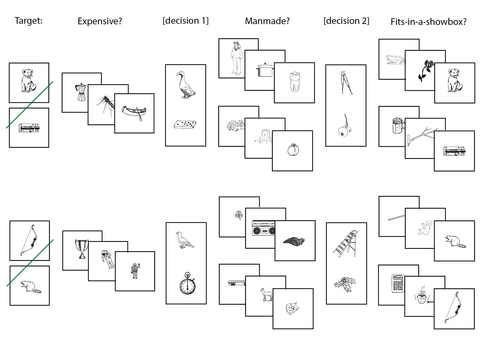

# **memory-research-analysis**
Repo contains all codes for data analysis and visualization of research data using iPython.

## The task
During the experiment, we asked participants (ages 18 to 25 years old) to complete a memory maze (what we called "double Y maze") where people first identify the target image and navigate through sequences of images to try to get back to the target image. The _goal_ of the game is to navigate back to the target image with the correct route. There are _3 types of results_ for the memory game:
- **correct**: navigate back to the target image successfully with all correct decisions making.
- **wrong route**: navigate back to the target image successfully with only 1 correct decision at decision point 2.
- **incorrect**: fail to navigate back to the target image.

### While navigating in the game..
There are _2 types_ of questions: **fixed answers questions** and **decision points**.
- **Fixed answers questions**: before starting the game, We ask participants a set of questions that have fixed answers based on their own opinion (_eg. is a trophy expensive?_). Those answers to the questions will never change throughout the game.
- **Decision points**: There are _2 decision points_ during the navigations. The participants need to get both decisions correct, which means the correct navigation route to receive a reward(a screen showing correct); If the participants successfully navigate back to the target but through the wrong route, there will be no reward but the screen will show "wrong route"; If the participants did not navigate back to the original target image, the screen will display "incorrect" as a punishment.

